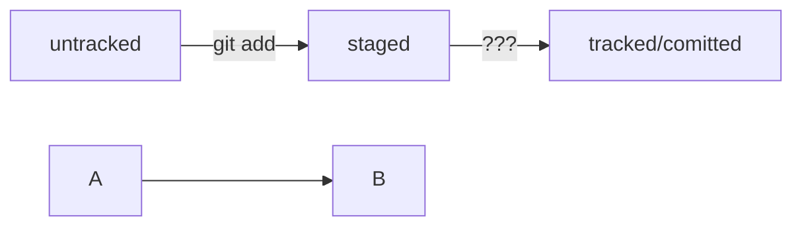
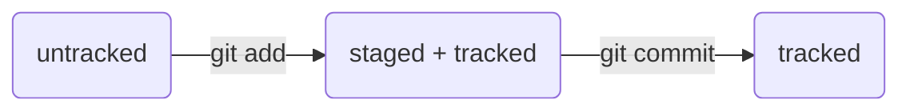

# Краткий справочник моего обучения работы с Git

## Команды git
**git init**      - инициализация репозитория

**rm -rf .git**   - разгитить папку

**git statusd**   - проверить статус репозитория

**git add --all** - подготовить к сохранению все файлы в репозитории

**git add .**     - добавить всю текущую папку

**git commit -m 'сообщение'** - сделать коммит

**git log**       - просмотреть историю коммитов

**git log --oneline** - вывести сокращенную историю коммитов (не более 72 первых символов сообщения)

## Связать локальный и глобальный репозитории
**git remote add origin https://github.com/%ИМЯ_АККАУНТА%/first-project.git** - привязать внешний аккаунт

**git remote -v** - убедиться, что репозитории связаны

**git push** - отправить изменения на удаленный репозиторий

**git push -u origin master** - для первой отправки изменений на удаленный репозиторий, флаг -u свяжет локальную и удаленную ветку

## Оформление коммитов (Conventional Commits)
https://www.conventionalcommits.org/ru/v1.0.0-beta.4/#%D1%81%D0%BF%D0%B5%D1%86%D0%B8%D1%84%D0%B8%D0%BA%D0%B0%D1%86%D0%B8%D1%8F

## Статус и жизненный цикл файлов
https://github.blog/2022-02-14-include-diagrams-markdown-files-mermaid/

